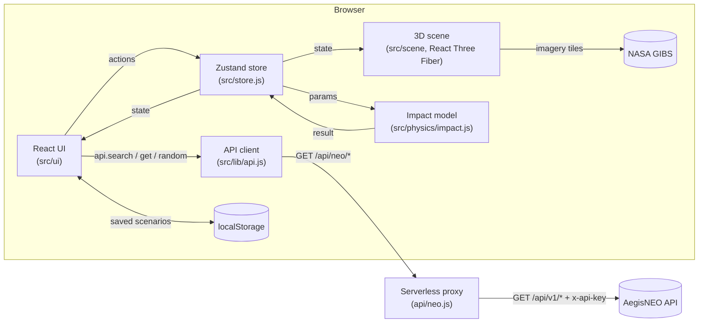
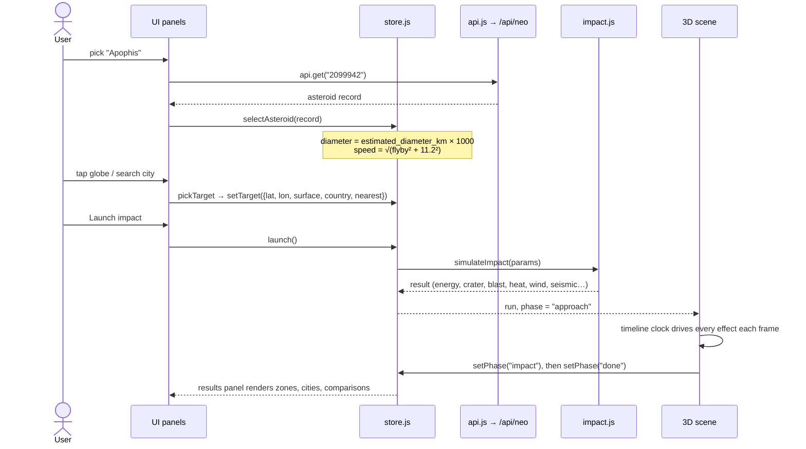

# Impactor architecture

How Impactor is built: the parts, how data moves between them, and why it is built this way.

---

## 1. Overview

Impactor is a single-page React app. It runs the physics in the browser and draws the impact with
three.js. The only server code is a small Vercel function that forwards requests to the AegisNEO API
with a secret key.



| Layer            | Technology                                                                   |
| ---------------- | ---------------------------------------------------------------------------- |
| UI               | React 19, plain CSS (`src/styles/global.css`), Inter and Space Grotesk fonts |
| State            | Zustand 5 (one store)                                                        |
| 3D               | three.js 0.186, React Three Fiber 9, drei, postprocessing (bloom, FXAA)      |
| Maps / geography | d3-geo, topojson-client, Natural Earth outlines (`world-atlas`)              |
| Imagery          | NASA GIBS tiles (Blue Marble, Black Marble, ASTER GDEM), no key needed       |
| Build / test     | Vite 8, Vitest 5, ESLint 10, Prettier                                        |
| Hosting          | Vercel (static site + one serverless function)                               |

---

## 2. Folder structure

```
impactor/
├── api/neo.js              Serverless proxy to the AegisNEO API (the only server code)
├── tests/proxy.test.js     Proxy tests (outside api/, where every file becomes a function)
├── public/favicon.svg
├── index.html
├── vite.config.js          Dev-server proxy, build chunks, test settings
├── vercel.json             /api/neo/* rewrite, security and cache headers
├── docs/                   This documentation
└── src/
    ├── main.jsx            Entry point
    ├── App.jsx             Layout, lazy 3D scene, error boundary, 2D fallback, URL restore
    ├── store.js            All app state and actions (Zustand)
    ├── physics/
    │   ├── impact.js       Collins, Melosh & Marcus (2005) impact model
    │   ├── zones.js        Result → damage zones (shared by globe and legend)
    │   └── events.js       Reference events for scale, global consequences
    ├── scene/              Everything inside the 3D canvas
    │   ├── Scene.jsx       Canvas, lights, quality control, GPU context loss
    │   ├── Earth.jsx       Globe, atmosphere, clouds, click-to-target
    │   ├── surfaceShader.js  Day/night shader shared by globe, crater and water
    │   ├── useEarthTextures.js  Painted globe first, NASA imagery swapped in
    │   ├── DetailImagery.jsx    Sharper tiles streamed around the look point
    │   ├── GlobeControls.jsx    Drag/zoom/tilt navigation (impact mode)
    │   ├── globeNav.js     Camera maths for that navigation
    │   ├── CameraRig.jsx   Cinematic camera during an impact
    │   ├── ImpactScene.jsx Target marker, trajectory, asteroid, and the impact sequence
    │   ├── timeline.js     Playback clock and phases (approach → impact → done)
    │   ├── CraterPatch.jsx, craterShape.js   High-detail crater mesh
    │   ├── Ejecta.jsx, Debris.jsx, Plume.jsx, plumeModel.js, ShockFront.jsx, Fires.jsx
    │   ├── damageOverlay.js, zoneOverlay.js  Ground damage and zone rings on the globe
    │   ├── impactVisuals.js, framing.js, effects.js, noiseVolume.js, sphereMath.js
    │   ├── Flyby.jsx       Real flyby mode (to scale, in lunar distances)
    │   └── PostFX.jsx      Bloom and anti-aliasing
    ├── ui/                 Panels, HUD, top bar, camera buttons, 2D map, dialogs
    ├── lib/
    │   ├── api.js          API client (timeout, one retry, cache, plain-language errors)
    │   ├── share.js        Scenario ⇄ URL query string
    │   ├── scenario.js     Restore a scenario from a link or a saved entry
    │   ├── storage.js      Saved scenarios in localStorage
    │   ├── target.js       Pick a target: land/water, country, nearest city
    │   ├── world.js, earthPaint.js, earth.worker.js   Country data and globe painting
    │   ├── gibs.js         NASA GIBS tile maths and loading
    │   ├── geo.js, cityRange.js, format.js, limits.js, gpu.js
    └── data/
        ├── cities.js       ~200 major cities (name, country, lat, lon, population)
        └── presets.js      Famous asteroid IDs
```

---

## 3. How one simulation runs



1. **Asteroid**: `ObjectSection` asks the API for an asteroid and calls `selectAsteroid`, which loads its
   real diameter and entry speed (`realParamsFor` in `store.js`).
2. **Target**: every way of choosing a target (globe click, 2D map, city, coordinates, share link) goes
   through `pickTarget` in `lib/target.js`. It checks land or water against a land mask, finds the country
   and the nearest city, and stores the target.
3. **Launch**: `launch()` runs `simulateImpact` once, synchronously. It is a set of equations
   (plus one small numerical integral for atmospheric entry), not a step-by-step simulation. It stores the result, the inputs and the share-link query in `run`, and
   `LaunchBar` writes the query to the address bar.
4. **Playback**: `timeline.js` holds the clock outside React state, because it changes every frame.
   Each scene component reads it in `useFrame` and works out its own state for that moment: crater
   depth, ejecta positions, blast radius and so on. Nothing is simulated frame by frame, so pause,
   speed changes, skip and replay are exact.
5. **Results**: `ResultsSection` turns `run.result` into zones (`zonesFor`), cities in range
   (`citiesInRange`) and comparisons (`compareToEvents`).

With reduced motion, or on the 2D map, `launch()` goes straight to `phase = "done"`.

---

## 4. State

All state lives in one Zustand store (`src/store.js`):

| Group      | Fields                                                                                                                         |
| ---------- | ------------------------------------------------------------------------------------------------------------------------------ |
| Inputs     | `asteroid`, `diameterM`, `velocityKms`, `composition`, `angleDeg`, `azimuthDeg`, `target`                                      |
| Simulation | `run` (id, result, params, target, query), `phase` (`idle → approach → impact → done`), `paused`, `timeScale`, `reducedMotion` |
| View       | `mode` (`impact` / `flyby`), `view3d`, `webglFailed`, `quality`, `showZoneRings`, mobile `sheet` and `mobileTab`               |
| Requests   | `focusRequest`, `globeRequest`, `craterRequest`: counters the camera watches. Buttons bump them to ask for a flight.           |

Rules kept in the store, and covered by `store.test.js`:

- Changing size or speed marks the run **Hypothetical**. Composition doesn't.
- Launch is impossible without a target.
- A new target clears a finished run but can't change a running one.
- _Start over_ clears inputs, run and URL.

---

## 5. Talking to the AegisNEO API

```
browser ──GET /api/neo/asteroids?search=bennu──▶ Vercel rewrite ──▶ api/neo.js
api/neo.js ──GET {AEGISNEO_API_URL}/api/v1/asteroids?search=bennu + x-api-key──▶ AegisNEO API
```

- **Key stays on the server.** `api/neo.js` adds `AEGISNEO_API_KEY` from an environment variable. In
  development, `vite.config.js` sets up the same proxy, so the client code is identical.
- **Allow-list.** Only `asteroids`, `asteroids/random` and `asteroids/{id}` paths, and only known
  query parameters (`search`, `hazardous`, `min_diameter`, `max_diameter`, `sort`, `order`, `limit`,
  `offset`, `count`), are forwarded. Anything else gets a 404 without touching the API.
- **GET only.** Other methods get 405.
- **Caching.** Successful responses are cached at Vercel's edge for an hour
  (`s-maxage=3600, stale-while-revalidate=86400`). Random picks and errors are never cached.
- **Timeouts.** 15 s upstream. A timeout returns 504 and an unreachable API returns 502.
- **Client side** (`lib/api.js`): 15 s timeout, one retry for network and 5xx errors (Vercel cold
  starts), an in-memory cache for repeat requests, cancellation when a new search starts, and
  plain-language messages for 401, 404, 422 and 504.

Endpoints used:

| Feature                       | Endpoint                                                                |
| ----------------------------- | ----------------------------------------------------------------------- |
| Search                        | `GET /api/v1/asteroids?search=…&limit=30`                               |
| Largest / closest flybys      | `GET /api/v1/asteroids?sort=diameter&order=desc` · `sort=miss_distance` |
| Random / random hazardous     | `GET /api/v1/asteroids/random?hazardous=true`                           |
| Famous asteroids, share links | `GET /api/v1/asteroids/{neo_reference_id}`                              |

---

## 6. Saving and sharing without a database

- **Share links** (`lib/share.js`): the scenario is encoded in the query string, e.g.
  `?a=2099942&d=653.9&v=11.92&ang=45&az=90&c=stony&lat=-23.550&lon=-46.633`. Opening a link
  validates and clamps every value (`queryToScenario`), fetches the asteroid if there is one, sets the
  target and launches.
- **Saved scenarios** (`lib/storage.js`): up to 30 entries in `localStorage` under
  `impactor.saved.v1`. Each entry is the same query string, so restoring works exactly like a link.
- **Preferences**: the motion opt-in (`impactor.animate`) and zone rings (`impactor.zoneRings`).

All saving goes through `storage.js`, so a shared database could replace it later without
touching the UI.

---

## 7. Drawing the globe

1. **Painted globe first.** `earthPaint.js` paints day, night, water and land textures from Natural Earth
   outlines. It runs in a Web Worker (`earth.worker.js`) when the browser supports OffscreenCanvas, so
   the page never freezes, and falls back to the main thread otherwise.
2. **NASA imagery next.** `useEarthTextures.js` swaps in NASA GIBS mosaics: Blue Marble (shaded
   relief and bathymetry) for day, Black Marble for city lights. Level 3 on desktop, level 2 on phones.
   If GIBS can't be reached, the painted globe stays.
3. **Detail on zoom.** `DetailImagery.jsx` streams a 2048 px window (1024 px in low quality) of sharper
   tiles around the point the camera looks at, up to about 500 m colour and 31 m ASTER shaded relief.
   `surfaceShader.js` blends it in, on the globe, the crater patch and the water alike.
4. **Lighting.** The sun position is the real sub-solar point for the current time (`lib/geo.js`), so
   day and night on the globe match reality.

---

## 8. Drawing the impact

Every effect is sized from the model's result, so the picture always matches the numbers.
See [science.md](science.md#3-how-the-impact-is-drawn) for the rules behind each effect.

| Component                       | Shows                                                                                                |
| ------------------------------- | ---------------------------------------------------------------------------------------------------- |
| `ImpactScene.jsx`               | Trajectory, glowing asteroid, flash, and which effects to mount                                      |
| `CraterPatch.jsx`               | A detailed mesh carved to the crater's size, dug out then collapsing. The globe leaves a hole there. |
| `Ejecta.jsx`                    | Ejecta curtain, tumbling lit rocks, re-entering debris for huge impacts                              |
| `Debris.jsx`                    | Hot debris on ballistic arcs in rays                                                                 |
| `Plume.jsx`                     | Volumetric fireball and mushroom cloud (`plumeModel.js` drives it)                                   |
| `ShockFront.jsx`                | 3D blast wall moving at the model's arrival times                                                    |
| `Fires.jsx`, `damageOverlay.js` | Charred ground, fires, flattened forest, lights going out                                            |
| `zoneOverlay.js`                | Optional damage-zone rings                                                                           |
| `CameraRig.jsx`                 | Cinematic camera: approach, rumble, pull-back, final view                                            |
| `PostFX.jsx`                    | HDR bloom, so only things brighter than white glow                                                   |

---

## 9. Performance and robustness

- **Code splitting.** The 3D scene is `lazy()`-loaded and three.js gets its own chunk. The 2D map never
  downloads it.
- **Adaptive quality.** Phones and integrated GPUs (`lib/gpu.js`) start in `quality: "low"`: fewer
  particles, a quarter of the crater mesh, cheaper shader noise, smaller detail imagery. drei's
  `PerformanceMonitor` lowers the pixel ratio when the frame rate drops, then switches to low quality.
  It waits until an impact finishes, because rebuilding shaders mid-impact would freeze the view.
- **GPU particles.** Ejecta, debris and fire particles move in shaders, not in JavaScript.
- **Fallbacks.** No WebGL, a crash in the 3D code (`ErrorBoundary`), a GPU context that isn't restored
  within 4 s, or globe textures that fail to load: each switches to the 2D map
  (`FallbackMap.jsx`) with a message explaining why. The 2D map runs full simulations.
- **Lighthouse** (mobile preset, production build): total blocking time fell from about 10.5 s to under
  1.5 s after moving texture painting into the worker. Accessibility score 100.

---

## 10. Accessibility

- Skip link to the controls, landmarks and labelled regions.
- The city search is an ARIA combobox (arrow keys, Enter, Escape).
- Panels and the mobile sheet use proper tab, radio and menu roles. Status messages use `aria-live`.
- Keyboard navigation on the globe (arrow keys, `+` / `−`).
- 16 px inputs (no iOS zoom on focus), touch targets of 40 px or more, safe-area insets, `dvh` units.
- Respects `prefers-reduced-motion`, with an opt-in to animate anyway.

---

## 11. Security headers

`vercel.json` sets `X-Content-Type-Options: nosniff`, `Referrer-Policy: strict-origin-when-cross-origin`
and a `Permissions-Policy` that turns off camera, microphone and geolocation. Hashed assets are cached
for a year (`immutable`).

The proxy keeps the key out of the browser, but it is **not** access control. Anyone can call
`/api/neo/*`, and there is no rate limit. The key only tells the API which site is asking.
