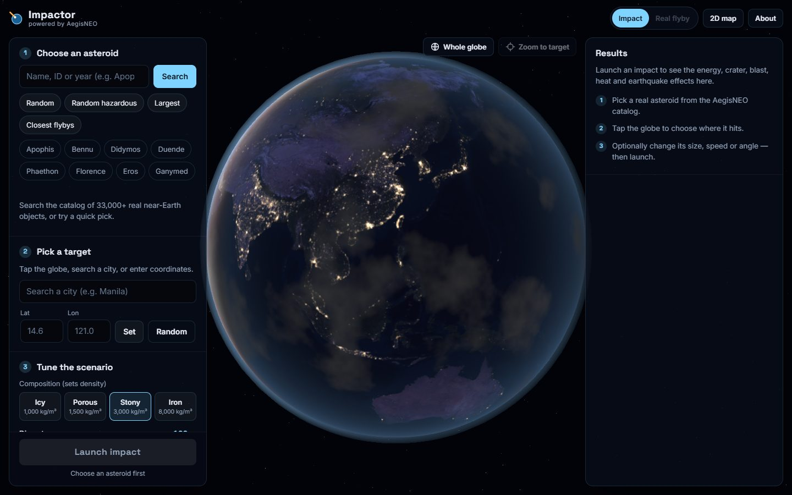
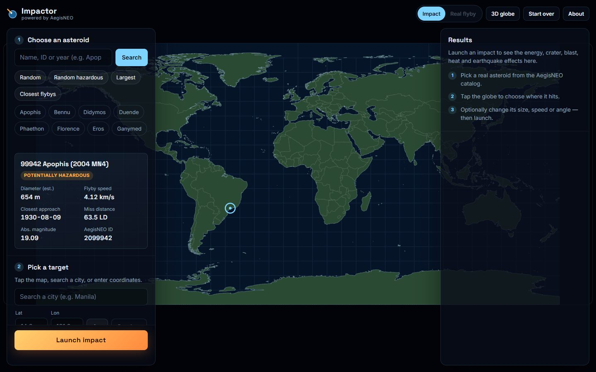
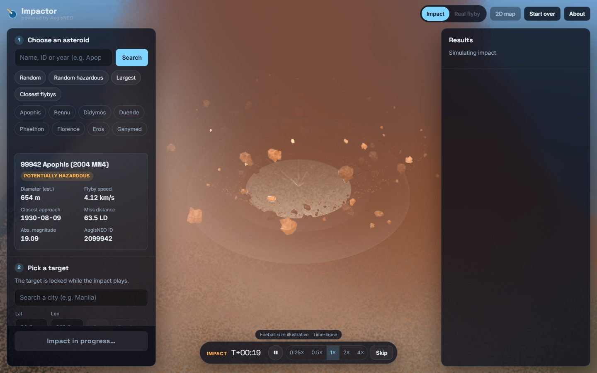
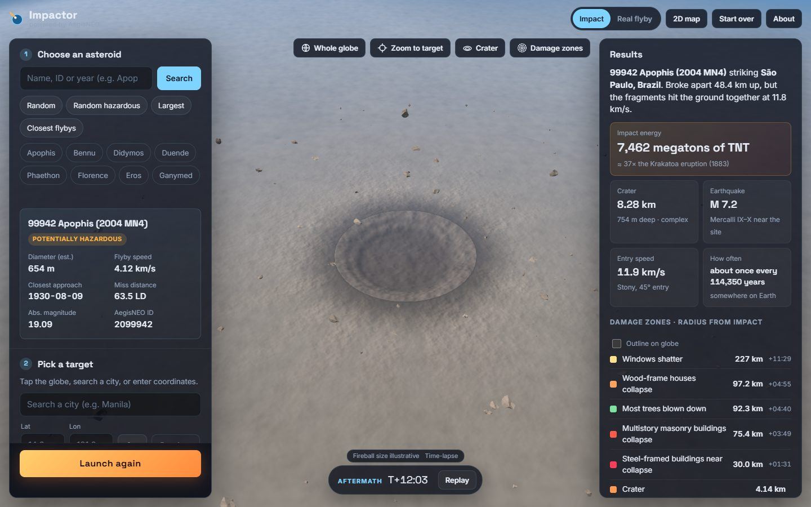
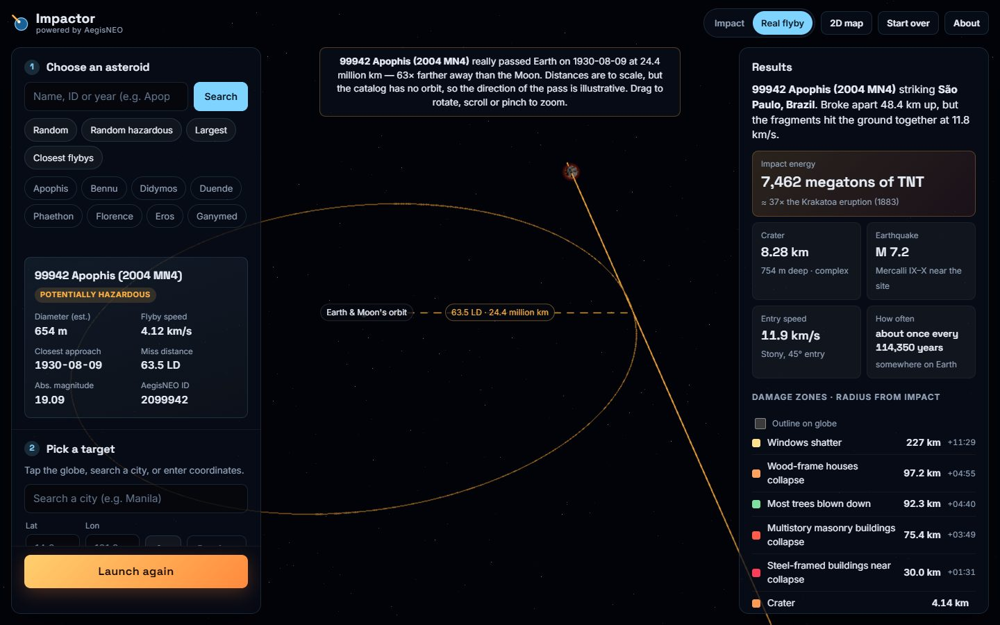
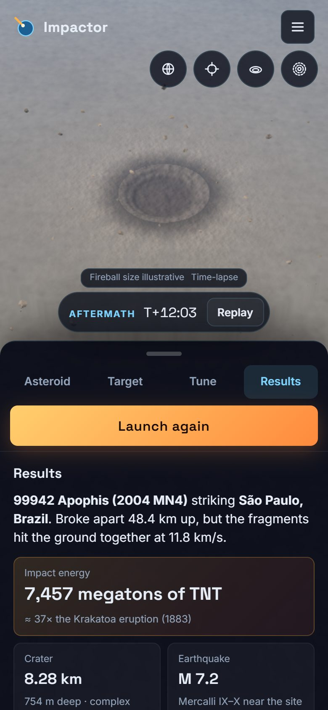

# Impactor user guide

How to use Impactor, from picking an asteroid to sharing the result.

Live site: **https://aegisneo-impactor.vercel.app**

---

## 1. The screen

| Area               | What it is                                                                                       |
| ------------------ | ------------------------------------------------------------------------------------------------ |
| **Left panel**     | The three setup steps (asteroid, target, tune), your saved scenarios, and the **Launch** button. |
| **Centre**         | The 3D globe. Day and night match the current time, with real NASA imagery and city lights.      |
| **Right panel**    | Results of the last impact.                                                                      |
| **Top bar**        | _Impact_ / _Real flyby_ mode, _2D map_ / _3D globe_, _Start over_ and _About_.                   |
| **Camera buttons** | _Whole globe_, _Zoom to target_, and after an impact _Crater_ and _Damage zones_.                |

On phones the panels become a bottom sheet with four tabs (see [Phones](#9-phones)).

---

## 2. Step 1: choose an asteroid

Every asteroid comes from the AegisNEO catalog (33,000+ real near-Earth objects).

- **Search** by name, ID or year, e.g. `Apophis`, `2099942` or `1998`.
- **Quick picks**: _Random_, _Random hazardous_, _Largest_, _Closest flybys_.
- **Famous asteroids**: Apophis, Bennu, Didymos, Duende, Phaethon, Florence, Eros, Ganymed.

The selected asteroid's card shows its estimated diameter, flyby speed, closest-approach date, miss
distance (in lunar distances, LD), absolute magnitude and whether NASA lists it as potentially hazardous.

Choosing an asteroid loads its **real size and speed** into the simulation.

---

## 3. Step 2: pick a target

Any of these sets the impact point:

- **Click or tap the globe** (or the 2D map).
- **Search a city** from a list of about 200 major cities. Arrow keys move through the list, Enter picks.
- **Type coordinates** (latitude −90 to 90, longitude −180 to 180) and press _Set_.
- **Random** picks a random spot on Earth.

Under the search box Impactor shows the place, whether it is a **land** or **ocean** impact, and the
nearest city. Land and ocean impacts are calculated differently.

The target is locked while an impact is playing.

---

## 4. Step 3: tune the scenario (optional)

| Control         | Range                     | Notes                                                                                         |
| --------------- | ------------------------- | --------------------------------------------------------------------------------------------- |
| **Composition** | Icy, Porous, Stony, Iron  | Sets the density (1,000 to 8,000 kg/m³). The catalog has no density, so Stony is the default. |
| **Diameter**    | 0.5 m to 100 km           | Logarithmic slider.                                                                           |
| **Entry speed** | 11.2 to 80 km/s           | Speed at the top of the atmosphere. Nothing arrives slower than Earth's escape velocity.      |
| **Entry angle** | 5° to 90° from horizontal | 45° is the most likely angle for a real impact.                                               |
| **Coming from** | 0° to 359° (N, NE, E…)    | Direction of approach. Changes the approach path and where debris lands.                      |

Changing the size or speed away from the catalog values marks the scenario **Hypothetical**.
_Reset to real values_ puts them back. Composition doesn't count, since it is a guess either way.

---

## 5. Launch and watch

Press **Launch impact**. (It stays disabled until there is an asteroid and a target. The note
under it says what's missing.)

The animation has three parts:

1. **Approach** (`T−`): the asteroid comes in along its entry path and heats up in the atmosphere.
2. **Impact** (`T+`): fireball, crater digging out and collapsing, ejecta curtain and rocks, the air
   blast sweeping outward, then fires, flattened forest and city lights going out where the model says
   they would. Small rocks break up high in the air (airburst) and leave no crater.
3. **Aftermath**: the dust settles and the camera pulls back to show the damage.

The bar at the bottom of the view controls playback:

- **Pause / play**
- **Speed**: 0.25×, 0.5×, 1×, 2×, 4× (on phones one button cycles through them)
- **Skip** jumps to the end, and **Replay** runs the same impact again.

The clock shows **real time** since impact. Some impacts have stages from seconds to hours apart, so the
animation can speed up as it plays. The **Time-lapse** label appears when it does.

Labels above the bar flag anything drawn larger than real so it can be seen, e.g.
_Crater depth ×4_, _Fireball ×N_, _Tsunami ring illustrative_ or
_Seabed crater seen through water_.

---

## 6. Read the results

| Result                     | Meaning                                                                                                                                          |
| -------------------------- | ------------------------------------------------------------------------------------------------------------------------------------------------ |
| **Summary**                | What happened, e.g. broke apart at 48 km altitude but the fragments hit the ground together.                                                     |
| **Impact energy**          | In megatons of TNT, compared with the nearest well-known event (Hiroshima, Tunguska, Krakatoa, Chicxulub…).                                      |
| **Crater**                 | Final diameter, depth, and simple or complex type. Airbursts have none.                                                                          |
| **Earthquake**             | Richter magnitude and Mercalli intensity near the site.                                                                                          |
| **Entry speed**            | Speed, composition and angle used.                                                                                                               |
| **How often**              | How often an impact this size happens somewhere on Earth.                                                                                        |
| **Damage zones**           | Radius of each effect (windows shatter, houses collapse, trees blown down, third-degree burns…) and when the blast arrives there, e.g. `+04:55`. |
| **Major cities in range**  | Cities inside the zones, each with the worst effect that reaches it.                                                                             |
| **Wider picture**          | Local, regional, continental or global consequences.                                                                                             |
| **How this is calculated** | The model and its assumptions, in short.                                                                                                         |

**Outline on globe** (or the _Damage zones_ camera button) draws the zones as rings on the globe.

### Share, save, export

- **Copy link**: the link holds the whole scenario. Whoever opens it sees the same impact replay.
- **Save**: keeps the scenario in this browser, listed under _Saved scenarios_ (up to 30). × deletes one.
- **Image**: downloads a PNG of the current 3D view.

---

## 7. Real flyby mode

**Real flyby** (top bar) shows what really happened: the asteroid's actual closest approach,
drawn to scale with Earth and the Moon's orbit. The catalog has no orbit data, so the direction of
the pass is illustrative. Only the distance is real. Drag to rotate and scroll or pinch to zoom.
**Impact** goes back.

---

## 8. Moving around the globe

| Action               | Mouse / keyboard                                    | Touch                   |
| -------------------- | --------------------------------------------------- | ----------------------- |
| Move the globe       | Drag                                                | Drag with one finger    |
| Zoom                 | Scroll wheel (zooms towards the pointer), `+` / `−` | Pinch                   |
| Tilt and turn        | Right-drag, or Shift/Ctrl + drag                    | Two-finger drag / twist |
| Pan with keys        | Arrow keys                                          | –                       |
| Back to the start    | **Whole globe** button                              | Globe button            |
| Fly to the target    | **Zoom to target**                                  | Crosshair button        |
| Close look at crater | **Crater** (after an impact)                        | Crater button           |

Zooming in loads sharper satellite imagery for the area in view (down to about 500 m per pixel, and 31 m
for terrain shading).

---

## 9. Phones

- The controls live in a **bottom sheet** with tabs: _Asteroid_, _Target_, _Tune_, _Results_.
  Drag the handle to resize it, or tap it to cycle between low, half and full height.
- After picking an asteroid the sheet switches to _Target_, so you can tap the globe next.
- After an impact the sheet stays low so the crater is visible. Drag it up for the results.
- The **menu** button (three lines) holds Impact, Real flyby, 2D map, Start over and About.
- The round buttons under the menu are the camera shortcuts (whole globe, target, crater, zones).

---

## 10. 2D map, reduced motion and when things go wrong

- **2D map** (top bar) swaps the globe for a flat map. It runs the same simulation and jumps
  straight to the results. Impactor switches to it automatically if the device can't show 3D,
  the graphics driver resets, or the globe fails to load.
- **Reduced motion**: if the device asks for reduced motion, impacts jump straight to the results.
  A checkbox under Launch, _Animate the impact_, turns the animation back on.
- **Slow device**: Impactor lowers the resolution and simplifies effects by itself when the frame
  rate drops. Phones and integrated graphics start in the lighter mode.
- **"Couldn't reach the AegisNEO API"**: the API may be waking up after being idle. Try again
  after a few seconds (Impactor already retries once).
- **Start over** clears the asteroid, target and impact and resets the address bar.

---

## 11. Your data

No accounts and no tracking. Saved scenarios stay in your browser (`localStorage`), and share links
carry the scenario in the URL. Nothing is stored on a server.

The numbers are estimates from a published scientific model, for learning. They are not predictions of
real hazards.
