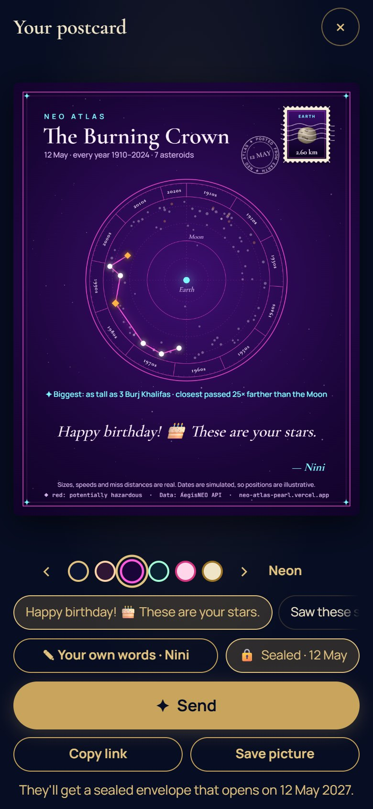

# NEO Atlas

A star atlas of real near-Earth asteroids, made for phones. Tell it your birthday and it reveals the real
asteroids that passed Earth on that day (in every year from 1910 to 2024), joins the biggest into your own
constellation, and turns it into a postcard you can send.

Live site: **https://neo-atlas-pearl.vercel.app**



## What it does

- **One question first.** A first visit shows only "When's your birthday?" and one button.
- **The reveal.** The sky fades in, the stars pop in and the constellation draws itself, with a made-up
  name such as _The Iron Crown_. _Shuffle_ tries another shape; _Draw my own_ joins stars by hand.
- **Postcards in one tap.** The card fills the screen: swipe for six looks, tap a ready-made message or
  write your own, then _Send_. Every postcard starts blank; your name is remembered. The card has a
  postage stamp with the biggest asteroid's real size, a postmark and a line of fun facts
  (_"Biggest: as tall as 3 Burj Khalifas"_).
- **Your asteroid sign.** A horoscope-style card from your birthday's biggest asteroid: real numbers,
  made-up meanings, and it says so.
- **Star Match.** Someone who receives a birthday postcard adds their own birthday, and the two
  constellations are joined into one, with a playful match score and a reply postcard ready to send.
- **Sealed postcards.** Send one early: the link shows a sealed envelope and a countdown until the birthday.
- **The full atlas.** Every star is a real asteroid: tap for its size, speed and how close it came; browse
  by year or date, as a chart or a list; save constellations, export and import them.

Sizes, speeds and miss distances are real; **close-approach dates are simulated** (see below).

## Documentation

| Document                                    | What's in it                                                                  |
| ------------------------------------------- | ----------------------------------------------------------------------------- |
| [User guide](docs/user-guide.md)            | Every screen step by step: the reveal, postcards, the sign, Star Match, sealing, exploring |
| [Architecture](docs/architecture.md)        | Components, the main flows, link parameters, drawing the cards, the reveal, the API proxy |
| [Data and limits](docs/data-and-limits.md)  | What is real, simulated or just for fun; the sign and match rules; known limitations |
| [Testing](docs/testing.md)                  | Running the checks, what the 64 unit tests cover, the manual checklist         |

## How it uses the AegisNEO API

NEO Atlas is a separate website from the main AegisNEO site. It gets all of its asteroid data from the
[AegisNEO API](https://aegisneo-api.vercel.app/docs), to show the API can be used by other sites.

| Feature | API call |
| --- | --- |
| Catalog summary | `GET /api/v1/stats` |
| A year's sky (e.g. 1987) | `GET /api/v1/asteroids?search=1987-&limit=100&offset=…` |
| A date in every year (e.g. 12 May) | `GET /api/v1/asteroids?search=-05-12&limit=100&offset=…` |
| Ready-made constellations | `GET /api/v1/asteroids?sort=diameter&order=desc&limit=…` (and similar) |
| One asteroid | `GET /api/v1/asteroids/{neo_reference_id}` |

The browser never sees the API key. It calls `/api/neo/*` on this site, and a small server function
([`api/neo.js`](api/neo.js)) adds the key from an environment variable and forwards only these read-only
endpoints and their parameters; anything else is refused, so made-up parameters can't skip the edge cache.
In development, the Vite dev server runs the same function ([`vite.config.js`](vite.config.js)).

## No database

Nothing is stored on a server:

- **Links carry everything shareable**: the constellation (asteroid IDs, name and sky), and for a postcard
  its message (`pm`), sender (`pf`), look (`pt`) and seal date (`ps`). The full list is in
  [Architecture § 5](docs/architecture.md#5-the-link-is-the-database).
- **Pictures are drawn on the visitor's device** (postcards, sealed envelopes, sign cards); nothing is uploaded.
- **Saved constellations and the sender's name** are kept in the browser's `localStorage`.
- **Export / import** saves constellations to a JSON file and loads them back.

## Running locally

1. Start the AegisNEO API from the repository root:
   ```bash
   python -m uvicorn index:app --port 8000
   ```
2. In this folder, copy `.env.example` to `.env.local` and set `AEGISNEO_API_KEY` to a key the API accepts.
3. Install and run:
   ```bash
   npm install
   npm run dev
   ```

Other scripts: `npm test` (unit tests), `npm run lint`, `npm run build`.

## Deploying

NEO Atlas is deployed as its own Vercel project, separate from the API and the main site:

1. Create a new Vercel project from this repository and set **Root Directory** to `neo-atlas`.
2. Add environment variables:
   - `AEGISNEO_API_KEY`: the key issued to NEO Atlas.
   - `AEGISNEO_API_URL`: `https://aegisneo-api.vercel.app` (optional; this is the default).
3. On the API project, add the same key to `AEGISNEO_API_KEYS` as `neo-atlas:<key>`.
4. Recommended: in the Vercel dashboard, add a Firewall rate-limit rule for `/api/neo` (for example
   100 requests per minute per IP), since anyone can call the proxy.

The link preview image is `public/og.png`. `index.html` points to it at the production address, so
update that address if the site moves.

## Data

Asteroid records come from NASA's NeoWs feed (via the Kaggle "Nearest Earth Objects 1910–2024" dataset) and
are served by the AegisNEO API: 33,511 objects, one record each.

**The close-approach dates are simulated.** The Kaggle dataset has each object's size, speed, miss distance
and hazard class, but no date column, so the API gives every object a fixed date between 1910 and 2024,
derived from its ID (see `scripts/build_dataset.py`). A star's distance from Earth, its size and its hazard
marking are real; its position around the dial is illustrative. The site says so in the chart summary, the
"How to read" guide, the detail sheet and the footer.
