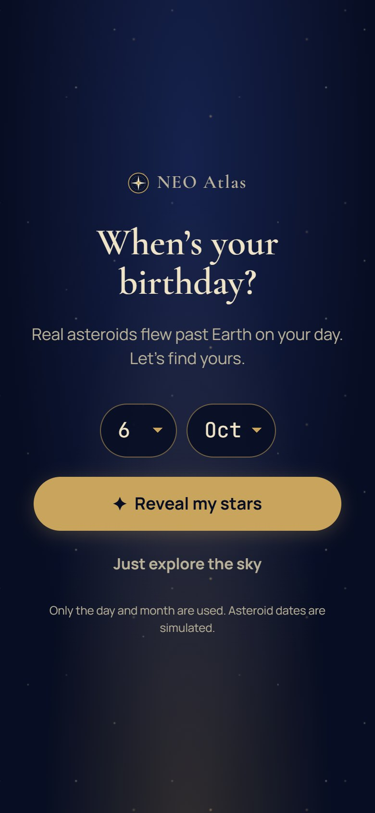
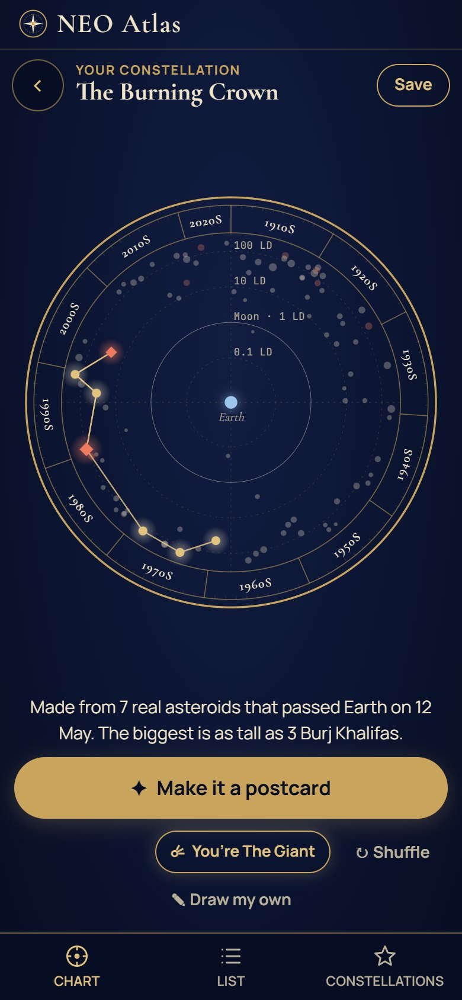
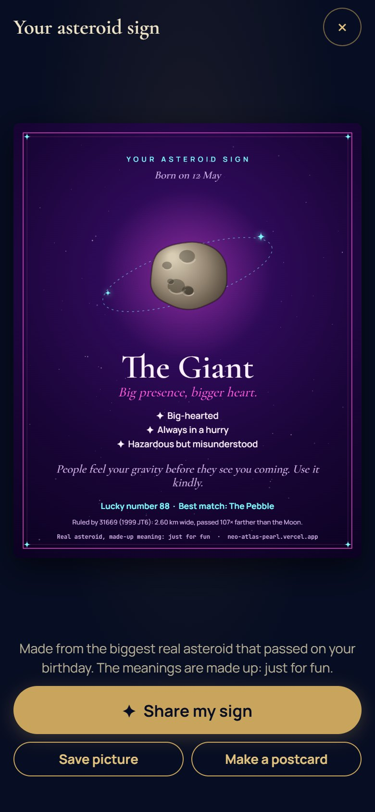
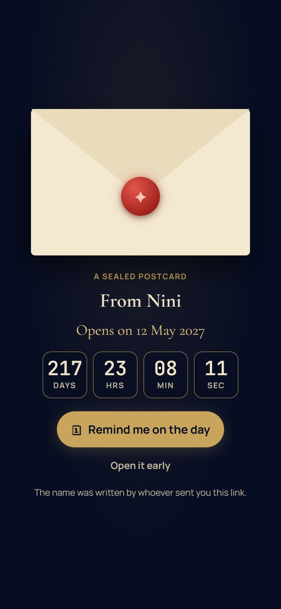
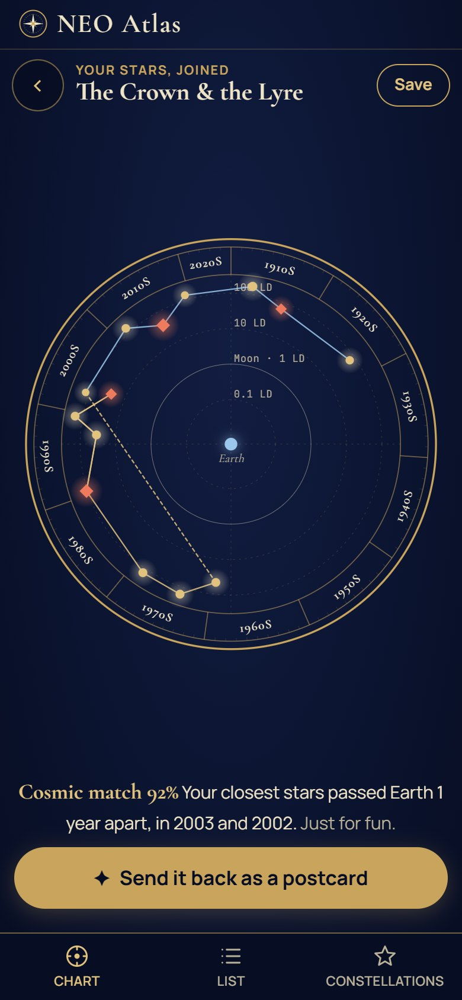
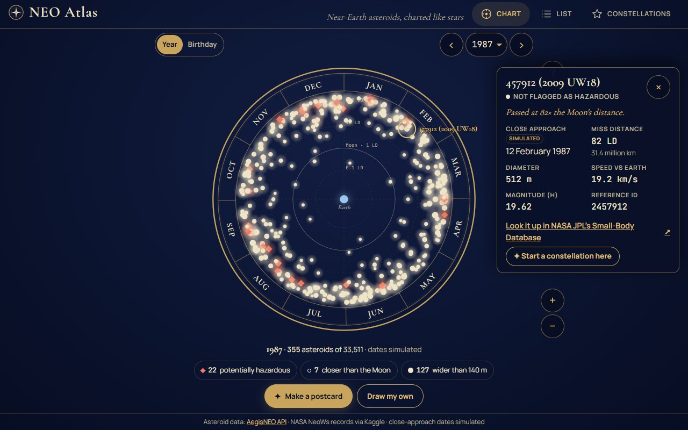

# NEO Atlas user guide

How to use NEO Atlas, from the first question to sending (and answering) a postcard.

Live site: **https://neo-atlas-pearl.vercel.app**

---

## 1. The first screen

A first visit asks one thing: **"When's your birthday?"** Pick the day and month and tap **Reveal my
stars**. Nothing else is on screen, so there is only one thing to do.

Above the question, a small **step trail** shows the whole journey: **① Your stars → ② Postcard → ③ Send**.
It comes back on each of those screens, with the current step lit and the steps behind it ticked, so you
always know where you are and what comes next.

- Only the day and month are used. The year is never asked for.
- **Just explore the sky** skips the question and opens the full star chart (see [§ 7](#7-exploring-the-sky)).
- The question only appears on a first visit to the plain address. Links to a postcard or a
  constellation open that instead.

---

## 2. Your constellation

The chart then **reveals** your birthday's sky in about three seconds:

1. the asteroids that passed Earth on your birthday (in every year from 1910 to 2024) fade in,
2. the biggest of them pop in one by one,
3. lines draw themselves between them, and the constellation's name is written in at the top.

The name is made up from the stars, e.g. _The Iron Crown_. The same birthday always gets the same first shape.

Under the chart there is the step trail, one line about it (for example _"Made from 7 real asteroids that
passed Earth on 6 Oct. The biggest is as tall as 2 Burj Khalifas."_), one big button and two small extras.
Everything else waits in the **⋯** menu, so the screen never has more than one main thing to do:

| Control                  | What it does                                                                |
| ------------------------ | --------------------------------------------------------------------------- |
| **Make it a postcard**   | Opens the postcard maker ([§ 4](#4-making-a-postcard)).                     |
| **You're The …**         | Your asteroid sign ([§ 3](#3-your-asteroid-sign)).                          |
| **Shuffle**              | A different shape from the same sky, revealed again.                        |
| **‹** (top left)         | Back to the plain sky (also the phone's Back button).                       |
| **⋯** (top right)        | **Save to Constellations**, **Share a link**, **Draw my own constellation** ([§ 7](#7-exploring-the-sky)) and **How to read the chart**. |

---

## 3. Your asteroid sign

Like a star sign, but made from the **biggest real asteroid** that passed on your birthday. Its real size,
speed and miss distance decide which of nine signs you get (The Giant, The Daredevil, The Hermit, The
Sprinter…), with three traits, a short reading, a lucky number and your best match.

The card says it plainly: **real asteroid, made-up meaning, just for fun.** The rules are in
[Data and limits § 5](data-and-limits.md#5-the-asteroid-sign).

**Share my sign** sends the picture with your phone's share sheet (on a computer: **Save my sign**).
**Make a postcard** goes straight to the postcard maker.

---

## 4. Making a postcard

The card fills the screen. Under it there are two tabs, **🎨 Look** and **💬 Words**, and only one of
them is open at a time, so the buttons have room and are easy to hit. Then one big **Send**, with a **⋯**
beside it for the other ways to send:

| To…                       | Do this                                                                                                     |
| ------------------------- | ----------------------------------------------------------------------------------------------------------- |
| change the look           | **Look**: tap one of the six colours (Midnight, Dusk, Neon, Aurora, Bubblegum, Parchment), or **swipe the card** sideways. |
| add a message             | **Words**: tap the message bar. Each tap puts the next ready-made message on the card (e.g. _"Happy birthday! 🎂 These are your stars."_). |
| write your own            | **Words** → **Write my own & add my name**, or tap the message or the title on the card itself.             |
| sign it                   | type your name in **From**. It is remembered on this device for your next postcard.                        |
| send it                   | **Send** (phones) opens the share sheet with the picture and a link. On a computer: **Copy link to send**.  |
| copy the link             | **⋯** → **Copy link** (phones).                                                                              |
| keep a copy               | **⋯** → **Save picture** downloads the card as a PNG.                                                       |
| seal it until the birthday | **⋯** → **Seal until …** (birthday postcards only, see below). Send then reads **Send sealed**.             |

A burst of little stars (and a short buzz on Android phones) confirms it was sent, and the step trail
ticks off **Send**.

**Every postcard starts blank.** Only your name is kept, so you never have to delete an old message.

**What's on the card:** the constellation on its star dial, its name and sky, a postage stamp showing the
biggest asteroid's real size, a postmark with the date, one line of fun facts (_"Biggest: as tall as 3 Burj
Khalifas · closest passed 31× farther than the Moon"_), your message and name, and fine print saying what is
real and what isn't.

### Sealed postcards

For a birthday constellation (not on the birthday itself), **⋯ → Seal until …** keeps the postcard shut until the
next time that birthday comes round. The person you send it to sees a sealed envelope with a countdown
instead of the card, and the picture sent with the link is the envelope too. Use **Save picture** if you
want the card itself.

---

## 5. Receiving a postcard

A postcard link opens on an **envelope** that opens by itself after a moment (or on a tap) and the card
slides out.

- **Sealed postcards** stay shut with a live countdown (days, hours, minutes, seconds). **Remind me on the
  day** saves a calendar file (`.ics`) for that date; **Open it early** opens it after a second tap. On the
  day itself it opens with a burst of stars and _"Happy birthday!"_
- **See it on the chart** shows the constellation with the rest of its sky behind it.
- **Make your own** starts at the birthday question.
- The sender's name and message are only ever shown as plain text, and the page says the sender wrote them.

---

## 6. Star Match

When the postcard is a birthday postcard, the main button is **Add your birthday**:

1. Pick your birthday and tap **Join our stars**.
2. Your birthday's constellation is made and **joined to the sender's**: their shape stays exactly as it was,
   a dashed bridge with a sparkle links it to yours, and your half is drawn in a second colour.
3. The pair gets a name from both halves (_The Crown & the Heron_) and a playful **Cosmic match** score with a
   real fact behind it: _"Your closest stars passed Earth 1 year apart, in 2000 and 1999."_
4. **Send it back as a postcard** opens the postcard maker with replies ready, e.g. _"Sam, look what our
   birthdays made ✨"_.

When the original sender opens the reply, they see the match score and can **Send one back**.

---

## 7. Exploring the sky

**Just explore the sky** (or **‹** from a constellation) shows the full atlas. On a phone the screen keeps
to the essentials: the sky at the top left, the **⋯** menu at the top right, the chart, one line about it,
and one big **Make a postcard** button.

- **The sky** (e.g. **Year 2024 ▾**) opens a short sheet: **Year / Birthday** chooses a whole year
  (1910–2024) or one date across every year. On a laptop the full picker sits there instead.
- **Each star is a real asteroid.** Tap one for its card: how close it came (in Moon distances), its size,
  speed and NASA's reference ID, with a link to NASA JPL's database.
- **Pinch** or scroll to zoom, drag to move; a reset button appears once you've zoomed. On phones the
  zoom buttons are hidden because pinching does the job.
- **⋯ → How to read the chart** (on a laptop, the **How to read** button on the chart) explains the dial:
  around the dial is the date, distance from the centre is the miss distance, star size is the asteroid's
  size, red diamonds are potentially hazardous.
- **⋯ → Potentially hazardous / Closer than the Moon / Wider than 140 m** picks those asteroids out. A chip
  under the chart shows which one is on; tap its **×** to show all again. (The List tab has them as chips.)
- **⋯ → Find my birthday stars** asks the birthday question again.
- **Make a postcard** makes and reveals a constellation from the current sky.
- **⋯ → Draw my own constellation** (or **Draw from this star** on a star's card): tap stars one after
  another, **Undo** removes the last, **Done** names and saves it.
- The **List** tab shows the same asteroids as a searchable, sortable list.
- The **Constellations** tab keeps your saved constellations, four ready-made ones from the whole catalog
  (The Giants, Closest Shaves, Speed Demons, The Watch List), and **Export / Import** to a file.

The line under the chart always says what to do next: _"Tap a star to meet it."_

---

## 8. Phones, laptops and motion

- Built for phones first: one main button per screen, nothing that needs scrolling to send a postcard,
  and the phone's **Back** button closes whatever is open (a star card, a postcard, a constellation).
- Held sideways, the card or chart sits on the left and the controls on the right.
- On laptops the postcard maker shows the card beside its controls.
- With **reduced motion** turned on in the phone or computer settings, the reveal, envelope and bursts are
  skipped and everything appears straight away, without vibration.

---

## 9. Your data

Nothing you type is uploaded or stored on a server, because there is no database:

- postcards are drawn on your device; the message, name, look and seal date travel **inside the link**;
- saved constellations and your remembered name stay in this browser (`localStorage`);
- **Export** saves constellations to a file you can **Import** on another device.

Anyone with a postcard link can read its message, so don't put anything private in one. See
[Data and limits](data-and-limits.md) for what is real and what is made up.
